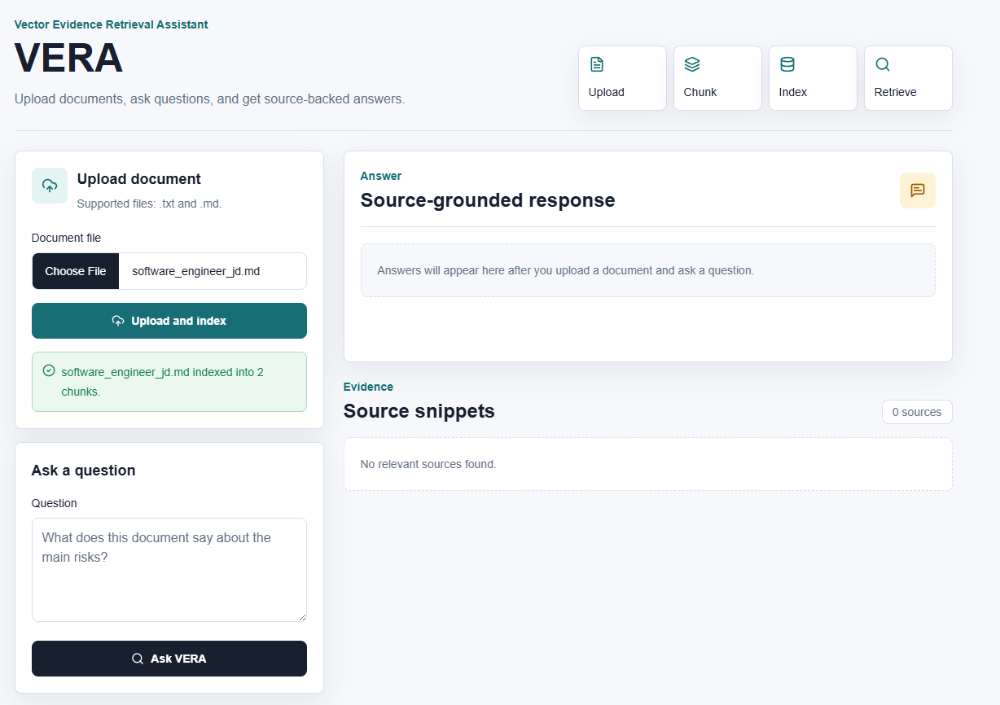
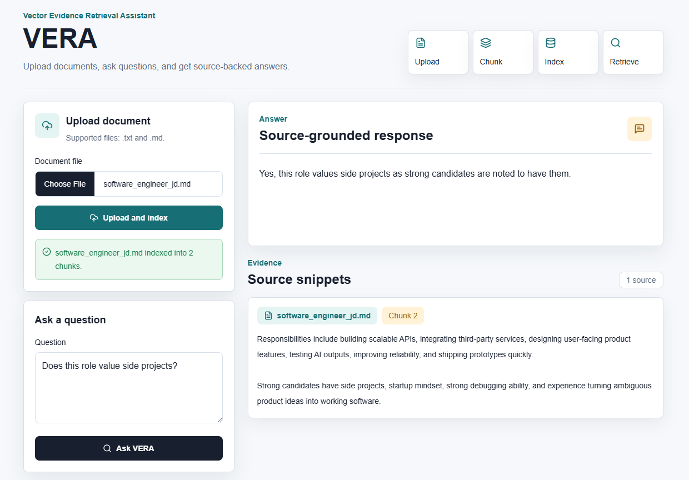
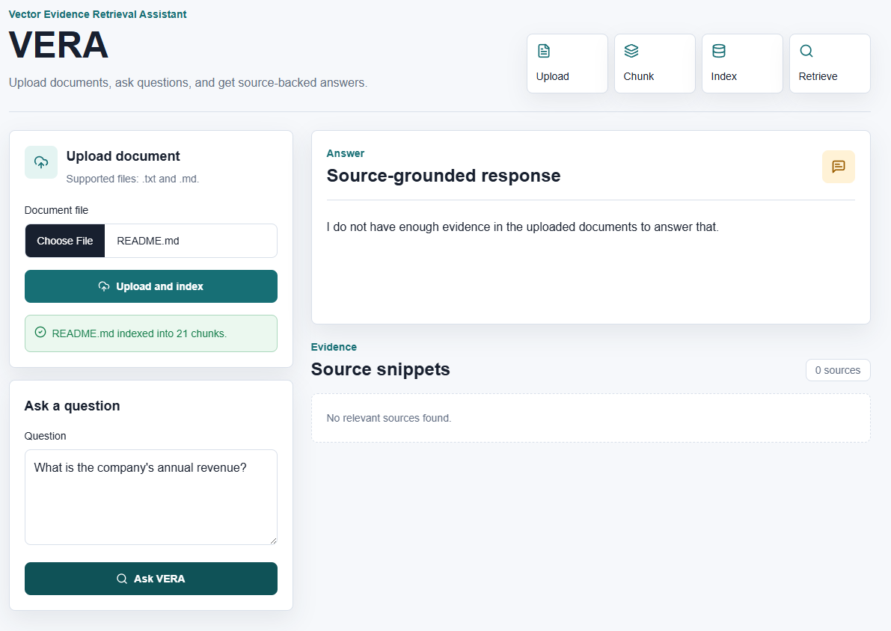
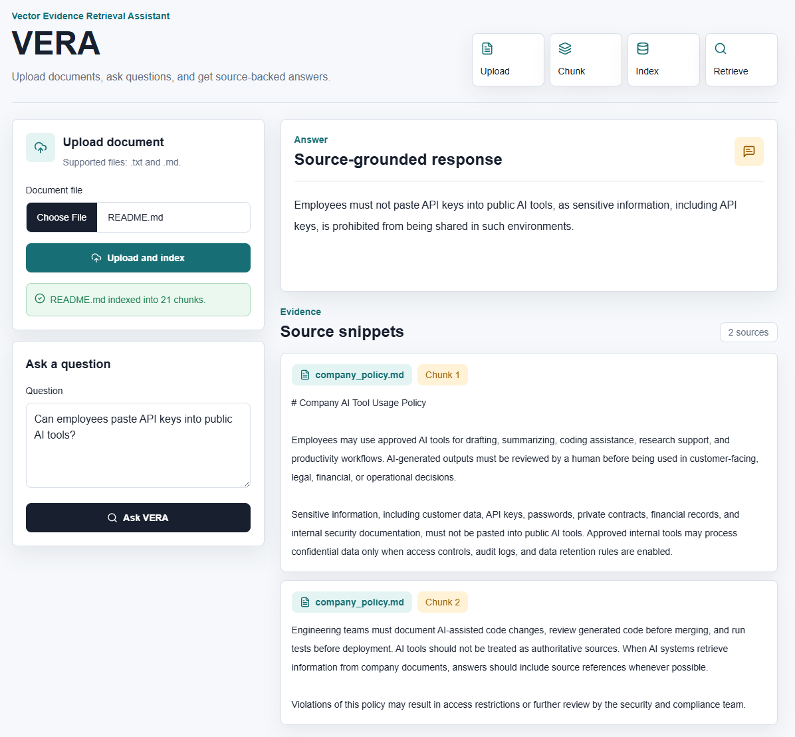

# VERA: Vector Evidence Retrieval Assistant

VERA is a full-stack LangChain RAG assistant that indexes uploaded documents into Chroma and answers questions with retrieved source evidence. It only displays source snippets when relevant evidence is found.

## Problem

Important information often lives inside long notes, reports, specs, and markdown files. Keyword search can miss relevant passages, and generic LLM answers are difficult to trust when they do not show their sources.

## Solution

VERA lets users upload `.txt` or `.md` documents one at a time, chunks the text, embeds each chunk with OpenAI embeddings, stores the vectors in Chroma, retrieves relevant evidence for a question, and generates a concise answer grounded in those retrieved snippets. Previously indexed documents remain searchable in the shared local Chroma store.

## Features

- Upload `.txt` and `.md` documents from a Next.js interface, one file at a time.
- Split documents into overlapping chunks with LangChain text splitters.
- Generate OpenAI embeddings and store chunks in a local Chroma vector database.
- Ask natural-language questions against indexed documents.
- Return source-grounded answers with source snippets, filenames, and chunk numbers when evidence passes the configured threshold.
- Filter weak source snippets so only sources above the source-display threshold are shown.
- Show no source cards when uploaded documents do not contain enough relevant evidence.
- Avoid guessing when retrieved evidence is weak or missing.
- Handle missing API keys, empty uploads, unsupported file types, empty questions, and empty vector stores.
- Run locally with a FastAPI backend and Tailwind-styled frontend.

## Tech Stack

- Frontend: Next.js, TypeScript, Tailwind CSS, lucide-react
- Backend: FastAPI, Python, LangChain, Chroma, OpenAI
- Vector database: Local Chroma store in `backend/chroma_db`

## Architecture

```text
User
  |
  v
Next.js Frontend
  |  POST /upload       POST /ask
  v
FastAPI Backend
  |
  +--> document_loader.py reads .txt/.md uploads
  +--> rag.py chunks text with LangChain
  +--> OpenAIEmbeddings creates vectors
  +--> Chroma stores chunks + metadata locally
  +--> Similarity search retrieves candidate chunks
  +--> Relevance filtering keeps up to 3 evidence-backed chunks
  +--> ChatOpenAI generates a grounded answer or says evidence is insufficient
  |
  v
Answer + relevant source snippets returned to the UI
```

## Demo Walkthrough

VERA is designed to show the full RAG flow: upload a document, index it into Chroma, ask a question, retrieve relevant evidence, and return a source-grounded answer. It also avoids guessing when the uploaded documents do not contain enough evidence.

### 1. Upload and Index Documents



Users upload `.txt` or `.md` files one at a time. VERA chunks each document, indexes those chunks into the shared local Chroma vector store, and keeps previously indexed documents searchable for later questions.

### 2. Source-Backed Answer



After a user asks a natural-language question, VERA retrieves relevant chunks and generates an answer grounded in the displayed source snippets. Source cards show the filename and chunk number so the evidence is easy to trace.

### 3. No-Evidence Handling



When retrieved evidence is insufficient, VERA does not guess. It returns a clear no-evidence answer, shows zero sources, and avoids displaying random source cards.

### 4. Multi-Document Filtering



Users can upload multiple documents one at a time while VERA searches across the shared vector store. Weak or unrelated source snippets are filtered out so only relevant evidence is displayed.

Relevance scores are used internally for filtering, but the UI only shows source snippets, filenames, and chunk numbers to keep the experience user-facing and readable.

## Quick Start

Prerequisites:

- Node.js and npm
- `uv` for Python dependency management
- An OpenAI API key

Run the full local setup from the project root:

```bash
npm run setup
npm run dev
```

The setup command asks for your OpenAI API key once, stores it only in `backend/.env`, creates `frontend/.env.local`, installs backend dependencies with `uv sync`, and installs frontend dependencies with `npm install`.

The frontend runs at `http://localhost:3000`.
The backend runs at `http://localhost:8000`.

### Local Commands

```bash
npm run setup          # prepare backend, frontend, and local env files
npm run dev            # start backend and frontend together
npm run backend        # start only the FastAPI backend
npm run frontend       # start only the Next.js frontend
npm run doctor         # check local readiness
npm run clean:secrets  # remove backend/.env and frontend/.env.local
npm run clean:data     # remove backend/chroma_db
npm run clean          # remove secrets and local Chroma data
```

### API Key Security

- `backend/.env` is ignored by Git.
- The OpenAI API key is never written to the frontend.
- The frontend only receives `NEXT_PUBLIC_API_BASE_URL`.
- Do not create `NEXT_PUBLIC_OPENAI_API_KEY`; any `NEXT_PUBLIC_*` value is exposed to the browser.
- Run `npm run clean:secrets` to remove local env files.
- Run `npm run clean:data` to reset local Chroma data.

### Manual Setup

Backend:

```bash
cd backend
uv sync
uv run uvicorn app.main:app --reload
```

Optional legacy backend fallback:

```bash
cd backend
python -m venv .venv
source .venv/bin/activate
# Windows:
# .venv\Scripts\activate
pip install -r requirements.txt
uvicorn app.main:app --reload
```

Frontend:

```bash
cd frontend
npm install
npm run dev
```

## Environment Variables

### `backend/.env`

```env
OPENAI_API_KEY=your_openai_api_key_here
CHROMA_DB_DIR=./chroma_db
RELEVANCE_THRESHOLD=1.40
SOURCE_DISPLAY_THRESHOLD=0.47
```

Optional backend settings:

```env
OPENAI_CHAT_MODEL=gpt-4o-mini
OPENAI_EMBEDDING_MODEL=text-embedding-3-small
CHROMA_COLLECTION_NAME=vera_documents
RELEVANCE_THRESHOLD=1.40
SOURCE_DISPLAY_THRESHOLD=0.47
```

### `frontend/.env.local`

```env
NEXT_PUBLIC_API_BASE_URL=http://localhost:8000
```

Run `npm run doctor` any time to verify the local environment without printing secrets.

## API Endpoints

### `GET /`

Health check.

Response:

```json
{
  "status": "ok",
  "service": "VERA API"
}
```

The backend may include `relevance_score` in source metadata for debugging and future developer tooling. The UI does not display raw relevance scores to users.

### `POST /upload`

Accepts a multipart file upload named `file`. Supported file types are `.txt` and `.md`.

Response:

```json
{
  "filename": "notes.md",
  "chunks_indexed": 8,
  "message": "Indexed 8 chunks from notes.md."
}
```

### `POST /ask`

Request:

```json
{
  "question": "What are the main risks mentioned in the document?"
}
```

Response:

```json
{
  "answer": "The document identifies schedule risk and unclear ownership as the main risks.",
  "sources": [
    {
      "content": "Source snippet text...",
      "metadata": {
        "filename": "notes.md",
        "chunk_id": 2,
        "relevance_score": 0.82
      }
    }
  ],
  "has_evidence": true
}
```

No-evidence response:

```json
{
  "answer": "I do not have enough evidence in the uploaded documents to answer that.",
  "sources": [],
  "has_evidence": false
}
```

## Example Usage

The screenshots in the Demo Walkthrough show this flow end to end.

1. Start the backend.
2. Start the frontend.
3. Upload a `.txt` or `.md` file.
4. Wait for the indexed chunk count.
5. Upload more files one at a time if needed; earlier uploads remain searchable.
6. Ask a question about the uploaded content.
7. Review the answer and relevant source snippets, or the no-evidence message when VERA cannot support an answer.

## Sample Questions

- What is the main argument of this document?
- What risks or limitations are mentioned?
- Which decisions or action items are listed?
- What evidence supports the conclusion?
- Summarize the document in five bullet points.

## Limitations

- VERA currently supports `.txt` and `.md` files only.
- Chroma data is stored locally, so deployments need persistent storage or an external vector database.
- Answers depend on the quality of retrieved chunks, the configured OpenAI model, `RELEVANCE_THRESHOLD`, and `SOURCE_DISPLAY_THRESHOLD`.
- VERA filters Chroma results by raw distance, so lower scores are better and chunks pass when distance is at or below `RELEVANCE_THRESHOLD`.
- VERA only displays source snippets whose internal display relevance score is at or above `SOURCE_DISPLAY_THRESHOLD`.
- A lower distance threshold may hide useful evidence; a higher distance threshold may admit weak evidence.
- A lower source-display threshold may show weak source cards; a higher source-display threshold may hide useful source cards.
- The app does not include authentication, multi-user isolation, PDF parsing, or document deletion.

## Continuous Integration

The GitHub Actions CI workflow checks:

- Secret safety
- Backend dependency installation
- Backend compile/import safety
- Frontend dependency installation
- Frontend lint if available
- Frontend production build

CI does not require an OpenAI API key and does not run live OpenAI requests.

## Future Improvements

- Add PDF and DOCX parsing.
- Add document management with delete and re-index controls.
- Add developer diagnostics for retrieval and source filtering.
- Add streaming answers.
- Add automated backend and frontend tests.
- Support deployed Chroma or another managed vector database.

## License

This project is licensed under the MIT License.

## Resume Bullet Points

- Built a full-stack LangChain RAG application that indexes uploaded documents into a Chroma vector database and answers questions using retrieved source evidence.
- Implemented document chunking, OpenAI embeddings, vector similarity search, and source-backed answer generation through a FastAPI backend and Next.js frontend.
- Designed a production-style AI search workflow with file upload, retrieval, answer generation, source snippets, error handling, and Vercel-ready frontend structure.
